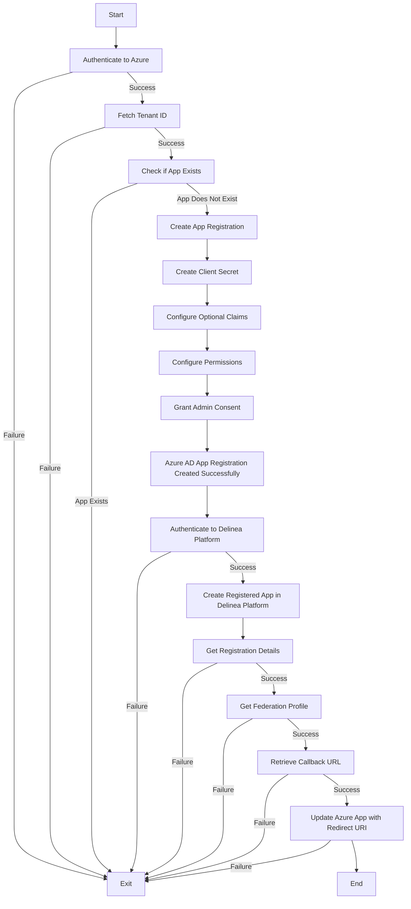

# Entra ID App Registration Automation Script

## Overview

This script automates creating and configuring an Azure/Entra ID App Registration using the Azure CLI. It streamlines tasks such as app registration, client secret generation, optional claims configuration, permission assignments, granting admin consent, and updating the redirect URI. This script can also create and configure a corresponding Delinea Platform Registered App.

## Features

- **App Registration**: Automatically registers a new Azure and Delinea Platform app.
- **Client Secret Management**: Generates a client secret with a configurable expiration period.
- **Permissions**: Adds delegated and application permissions with admin consent.
- **Optional Claims**: Configures email and UPN claims in ID tokens.
- **Updates Redirect URI**: Updates the redirects URI for the new Azure App
- **Error Handling**: Provides detailed error messages for troubleshooting.

## Prerequisites

- [Azure CLI](https://learn.microsoft.com/en-us/cli/azure/install-azure-cli) installed and authenticated (`az login`).
- In Azure, you must be able to create an app registration and manage API permissions. Roles that satisfy these requirements are:  Global Administrator and Privileged Role Administrator
- In the Delinea Platform, you must be able to create an app registration and query identity federation
- Python 3.x environment.
- PIP3 command line tool for installing Python 3 modules.
- You need the following Python modules:
  - **subprocess**: Standard library module for running system commands.
  - **json**: Standard library module for working with JSON data.
  - **datetime**: Standard library module for working with dates and times.
  - **time**: Standard library module for working with time-related functions.
  - **requests**: Third-party module for making HTTP requests.
  - **colorama**: Third-party module for colored terminal text.

## Setup

1. Clone the repository.

2. Before running the script, update the configuration variables in `config.py`

- PLATFORM_URL = "https://yourplatform.url"  # Your Platform tenant URL (e.g. https://your-hostname.delinea.app)
- PLATFORM_CLIENT_ID = "your_client_id"  # Client ID for the Delinea platform (client credentials)
- PLATFORM_CLIENT_SECRET = "your_client_secret"  # Client secret for the Delinea platform
- APP_NAME = "YourAppName"  # Sets the name for the app registration and will apply to both Azure and Platform.
- DOMAIN_NAMES = "yourdomain.com"  # Domain name for the registered app, separated by commas.
- PLATFORM_SCOPE = "your_scope" # Specifies the scope for the Delinea platform
- AZURE_TENANT_ID = "azure_tenant_id" # Specifies the tenant id in Azure
  
3. (Optional) For easy installation of the necessary third-party modules, you can then install the modules listed in `requirements.txt` using the following command:

```sh
pip3 install -r requirements.txt
```

4. Run the script:
```bash
python3 create_app.py
```

## Script Overview

The script performs the following steps:

1. Authenticate to Azure: Logs in to Azure using the Azure CLI.
2. Fetch Tenant ID: Retrieves the tenant ID of the Azure account.
3. Check if App Exists: Checks if an app with the specified name already exists.
4. Create App Registration: Creates a new Azure app registration.
5. Create Client Secret: Creates a client secret for the app registration.
6. Configure Optional Claims: Configures optional claims for the app registration.
7. Configure Permissions: Configures the necessary permissions for the app registration.
8. Grant Admin Consent (still to be added - stay tuned...)
9. Authenticate to Delinea Platform: Authenticates to the Delinea Platform using client credentials.
10. Create an App on the Delinea Platform: Creates a registered app on the Delinea Platform.
11. Update Azure App with Redirect URI: Updates the Azure app with the redirect URI from the Delinea Platform.



## Customization
- Modify optional_claims_config to add or update optional claims.
- Update permissions dictionaries to include additional delegated or application permissions.
- Various optional settings are also available - see `config.py`


## Troubleshooting

- Verify Azure CLI authentication and permissions.
- Verify Platform authentication and permissions.
- Check detailed error messages for specific issues.
- Ensure Azure CLI is up-to-date.
- If you encounter any issues, please refer to the error messages in the script output and make sure that your configuration variables in `config.py` are correct.

## Notes

- Changes may take time to propagate in Azure and Delinea Platform.
- Store the generated client secret securely; it is shown only once.
