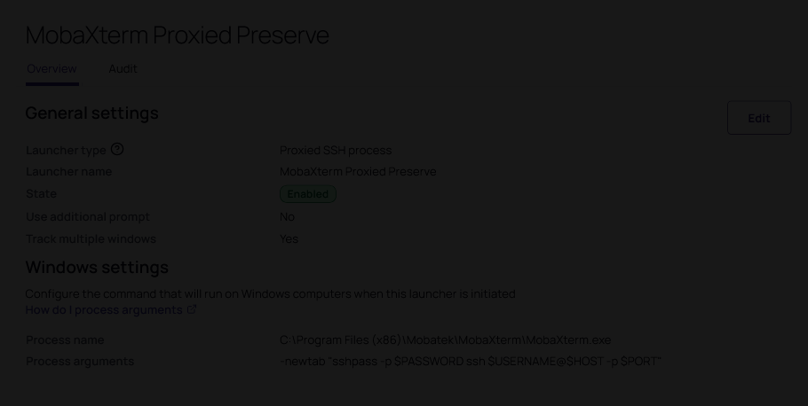

# Introduction

This document provides the details for creating a custom Launcher for MobaXterm. The first launcher is intended to work for SSH username/password accounts, whereas the second is for SSH keys. The second launcher is designed to work with SSH keys without a passphrase. If the keys do have a passphrase, it will need to be manually entered at this time.

## Template

Please note that with this launcher we simply leverage default templates. For the first launcher, we use the default "Unix Account (SSH)" template. For the second launcher, we use the "Unix Account (SSH Key Rotation) template. Consider duplicating these templates and naming them appropriately for use with MobaXTerm. For the second launcher, ensure that an additional field called "SecretID" is added to the template.

# Create Launcher (MobaXterm SSH)

1. Navigate to **Admin | Secret Templates**
1. Click **Configure Launchers** button
1. Click **New**
1. Enter a **Launcher Name** ex: `MobaXterm SSH`
1. Enter the **Process Name**: `C:\Program Files (x86)\Mobatek\MobaXterm\MobaXterm.exe ` This is the default location path. Adjust this if required
1. Enter the **Process Arguments**: `-newtab "sshpass -p ‘$PASSWORD’ ssh $USERNAME@$MACHINE"`

**Note** 

If the password contains a single quote, ‘ then the launcher will fail. A review of this launcher found that you now need to enclose the password in single quotes, as above. If there is a single quote in the password, it will cut off the password and cause the launcher to fail. The workaround is to remove this character from the character set used in the password requirements for the template used. 

1. Leave **Run Process as Secret Credentials** option unchecked
1. Leave **Load User Profile** option unchecked
1. Leave **Use Operating System Shell** option unchecked
1. Uncheck **Wrap custom parameters with quotation marks** option
1. Click **Save**

# Configure Template Launcher (MobaXterm SSH)

1. Navigate to **Admin | Secret Templates**
1. Select your template
1. Click **Edit**
1. Click **Configure Launcher**. If there is an existing launcher associated to the template, remove it
1. Click **Add New Launcher**
1. Select MobaxTerm SSH for **Launcher Type to use**
1. Set **Domain** to `Machine`
1. Set **Password** to `Password`
1. Set **Username** to `Username`
1. Click **Save**

Create a secret and test/verify the launcher functions properly.

# Create Launcher (MobaXTerm SSH Key)
## Requirements  
This launcher requires a connection back to the Secret Server API via [Integrated Windows Authentiation ](https://docs.delinea.com/online-help/secret-server/authentication/iwa-webservices/configuring-iwa/index.htm) to retrieve the SSH Key. This is currently only possible for Secret Server Self Hosted environments.

1. Navigate to **Admin | Secret Templates**
1. Click **Configure Launchers** button
1. Click **New**
1. For **Launcher Type** choose **Batch File**
1. Create a Batch File with the following contents below and upload it to the launcher. Note that you can change the location where the key is downloaded, and at this time it is not purged. The key name is also hardcoded at this time, rather than being set by the secret. We can configure it to pull the actual name from the Secret if needed.

```powershell
START PowerShell.exe -noprofile -executionpolicy bypass -windowstyle hidden -command "new-item -path c:\ -name "Key" -itemtype "directory";$SSURL='https://yourthycoticinstanceurl/secretserver/winauthwebservices/api/v1/secrets/';$URI=$SSURL+'%1';$API=$URI+'/fields/private-key';Invoke-RestMethod -Uri $API -UseDefaultCredentials -Method Get -ContentType "Application/json" -OutFile "c:\key\id_rsa" -force"
cd "c:\Program Files (x86)\Mobatek\MobaXterm\"
START MobaXterm.exe -newtab "ssh -i c:/key/id_rsa %2@%3"
```

Please note, these are three lines of code in total.

1. Enter a **Launcher Name** ex: `MobaXterm SSH Key`
1. Enter the **Process Arguments**: `$SECRETID $USERNAME $MACHINE`
1. Checkmark the **User Operating System Shell** option
1. Click **Save**

# Configure Template Launcher (MobaXterm SSH Key)

1. Navigate to **Admin | Secret Templates**
1. Select your template
1. Click **Edit**
1. Click **Configure Launcher**. If there is an existing launcher associated to the template, remove it
1. Click **Add New Launcher**
1. Select MobaxTerm SSH for **Launcher Type to use**
1. Set **Domain** to `Machine`
1. Set **Password** to `Private Key Passphrase` (this is unused)
1. Set **Username** to `Username`
1. Click **Save**

Create a secret and test/verify the launcher functions properly. Ensure that the SecretID field is populated with an actual SecretID that is intended to be used with the launcher.

# Recording tabbed SSH sessions (`-newtab`)

MobaXterm merges new connections into a single tabbed window with `-newtab`.
Recording behaves very differently for tabbed sessions, so read this before
enabling recording.

Secret Server records SSH two independent ways:

| Recording path | Captured by | Behavior for tabbed sessions |
|---|---|---|
| **Session Replay** (keystroke / terminal text) | SSH **Proxy** (server-side) | Records **every** merged tab — but **only when Preserve SSH Client Process is enabled** |
| **Video** (screen capture) | Protocol Handler (client-side) | Records **only the first** tab in the window. Fundamental client-side limitation; **no setting fixes it.** |

## Supported configuration for recording tabbed MobaXterm sessions

1. Launcher type **Proxied SSH Process** (not "Process").
1. **Preserve SSH Client Process** enabled on the launcher.
1. **SSH Proxy** and session recording enabled (globally and on the secret).
1. Use the `-newtab` Process Arguments from the launcher recipe above.
1. **Audit tabbed sessions through Session Replay (keystroke/terminal text), not video.**

A launcher configured this way — note **Launcher type: Proxied SSH process** and **Track multiple windows: Yes** (set **Preserve SSH Client Process** to Yes as well):



With `-newtab`, MobaXterm hands the connection to an already-running instance
and the launched process exits; without **Preserve SSH Client Process** the
Protocol Handler watchdog force-closes the proxied session within seconds
(a blank ~1 second recording). Preserve keeps the merged session alive so the
proxy can record each tab.

## Not supported for auditable recording of tabbed sessions

- **Video recording of a tabbed client** — the first tab records; the rest are blank. Use Session Replay instead.
- **The "Process" launcher type with tabbed sessions is not supported for recording in any configuration.** A plain Process launcher has no SSH proxy, so there is no Session Replay; and "Process + Use SSH Tunneling with SSH Proxy" captures no keystroke/terminal text at all. Either way, a merged tab produces **no auditable recording**. Tabbed recording requires **Proxied SSH Process**.
- **Preserve SSH Client Process disabled, with tabbed sessions** — the merged session is force-closed within seconds.

The SSH-key launcher above shells out to a batch/PowerShell wrapper to stage the
key on disk; the tabbed recording rules apply to it equally. For non-tabbed use,
each session is an independent process and records normally; **Preserve SSH
Client Process** is optional.
