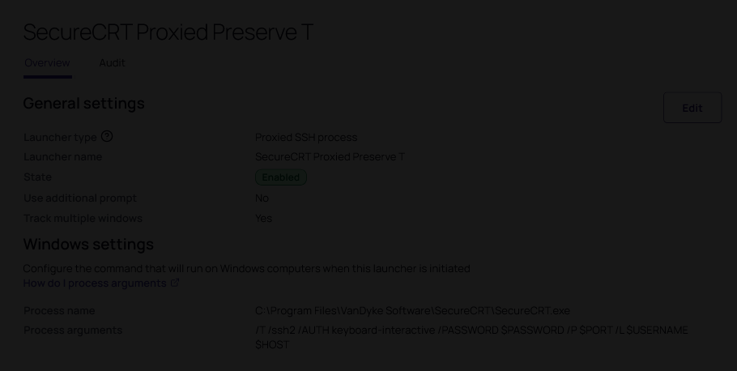

# SecureCRT SSH Launcher

Custom launcher for SecureCRT (SSH) with Secret Server. The launcher passes the
secret's credentials to SecureCRT on the command line so the session opens
without manual credential entry.

## Create Launcher (SecureCRT SSH)

1. Navigate to **Admin | Secret Templates** and click **Configure Launchers**.
1. Click **New**.
1. Enter a **Launcher Name**, e.g. `SecureCRT SSH`.
1. Enter the **Process Name**: `C:\Program Files\VanDyke Software\SecureCRT\SecureCRT.exe` This is the default location path. Adjust it if required.
1. Enter the **Process Arguments**: `/SSH2 /AUTH password /L $USERNAME /PASSWORD $PASSWORD $MACHINE`
1. Leave **Run Process as Secret Credentials** option unchecked.
1. Leave **Load User Profile** option unchecked.
1. Leave **Use Operating System Shell** option unchecked.
1. Uncheck **Wrap custom parameters with quotation marks** option.
1. Click **Save**.

Create a secret and test/verify the launcher functions properly.

## Recording tabbed SSH sessions (`/T`)

SecureCRT can merge new connections into a single tabbed window using the `/T`
switch. Recording behaves very differently for tabbed sessions, so read this
before enabling recording.

Secret Server records SSH two independent ways:

| Recording path | Captured by | Behavior for tabbed sessions |
|---|---|---|
| **Session Replay** (keystroke / terminal text) | SSH **Proxy** (server-side) | Records **every** merged tab — but **only when Preserve SSH Client Process is enabled** |
| **Video** (screen capture) | Protocol Handler (client-side) | Records **only the first** tab in the window. This is a fundamental client-side limitation and **cannot** be fixed by any setting. |

### Supported configuration for recording tabbed SecureCRT sessions

1. Launcher type **Proxied SSH Process** (not "Process").
1. **Preserve SSH Client Process** enabled on the launcher.
1. **SSH Proxy** and session recording enabled (globally and on the secret).
1. Add `/T` to the front of the Process Arguments, e.g. `/T /SSH2 /AUTH password /L $USERNAME /PASSWORD $PASSWORD $MACHINE`
1. **Audit tabbed sessions through Session Replay (keystroke/terminal text), not video.**

A launcher configured this way — note **Launcher type: Proxied SSH process** and **Track multiple windows: Yes** (set **Preserve SSH Client Process** to Yes as well):

Why **Preserve SSH Client Process** is required: with `/T`, SecureCRT hands the
new connection to an already-running instance and the originally launched
process exits. Without Preserve, the Protocol Handler watchdog sees that exit
and force-closes the proxied session within a few seconds — producing a blank
(~1 second) recording. Preserve keeps the merged session alive so the proxy can
record each tab.

### Not supported for auditable recording of tabbed sessions

- **Video recording of a tabbed client** — the first tab records; the rest are blank. Use Session Replay instead.
- **The "Process" launcher type with tabbed sessions is not supported for recording in any configuration.** A plain Process launcher has no SSH proxy, so there is no Session Replay; and "Process + Use SSH Tunneling with SSH Proxy" is a raw TCP relay that captures no keystroke/terminal text at all. Either way, a merged tab produces **no auditable recording**. Tabbed recording requires **Proxied SSH Process**.
- **Preserve SSH Client Process disabled, with tabbed sessions** — the merged session is force-closed within seconds (the blank recording described above).

For non-tabbed use (no `/T`), each session is an independent process and records
normally; **Preserve SSH Client Process** is optional.
